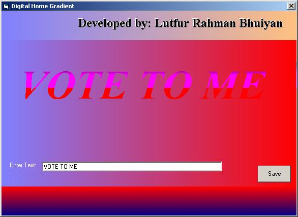

<div align="center">

## \[A1 Gradient Form and Picture with Gradient  and Emboss Text\]


</div>

### Description

A perfect Gradient Form and Picture with Emboss and Gradient Text Effect. Enter your text with a text box than save it a Bitmap file format.
 
### More Info
 
Graphics


<span>             |<span>
---                |---
**Submitted On**   |2004-06-23 05:04:02
**By**             |[Lutfur Rahman Bhuiyan](https://github.com/Planet-Source-Code/PSCIndex/blob/master/ByAuthor/lutfur-rahman-bhuiyan.md)
**Level**          |Intermediate
**User Rating**    |3.8 (15 globes from 4 users)
**Compatibility**  |VB 5\.0, VB 6\.0
**Category**       |[Graphics](https://github.com/Planet-Source-Code/PSCIndex/blob/master/ByCategory/graphics__1-46.md)
**World**          |[Visual Basic](https://github.com/Planet-Source-Code/PSCIndex/blob/master/ByWorld/visual-basic.md)
**Archive File**   |[\[A1\_Gradie1760956232004\.zip](https://github.com/Planet-Source-Code/lutfur-rahman-bhuiyan-a1-gradient-form-and-picture-with-gradient-and-emboss-text__1-54553/archive/master.zip)

### API Declarations

```
Private Declare Function CreateFontIndirect Lib "gdi32" Alias _
  "CreateFontIndirectA" (lpLogFont As LOGFONT) As Long
Private Type LOGFONT
 lfHeight As Long
 lfWidth As Long
 lfEscapement As Long
 lfOrientation As Long
 lfWeight As Long
 lfItalic As Byte
 lfUnderline As Byte
 lfStrikeOut As Byte
 lfCharSet As Byte
 lfOutPrecision As Byte
 lfClipPrecision As Byte
 lfQuality As Byte
 lfPitchAndFamily As Byte
 lfFaceName As String * 33
End Type
Private Declare Function SelectObject Lib "gdi32" (ByVal hdc As Long, _
 ByVal hObject As Long) As Long
Private Declare Function DeleteObject Lib "gdi32" (ByVal hObject As Long) As Long
Private Declare Function SetGraphicsMode Lib "gdi32" (ByVal hdc As Long, ByVal iMode As Long) As Long
Const GM_ADVANCED = 2
```


